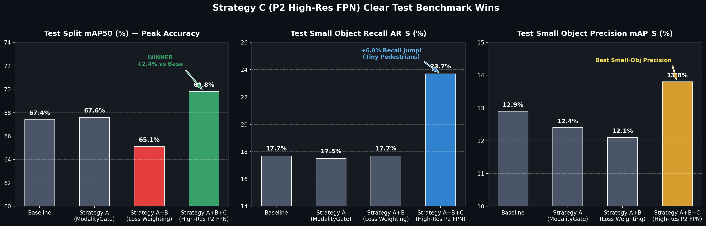
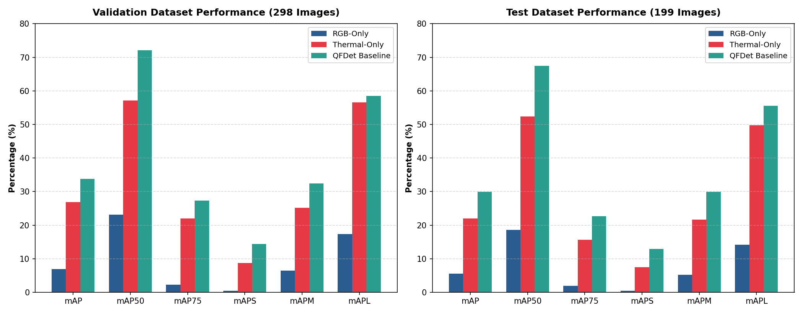
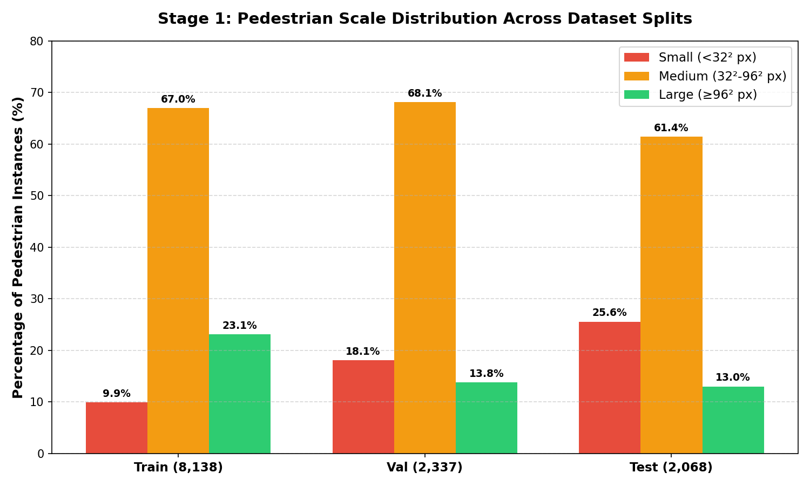
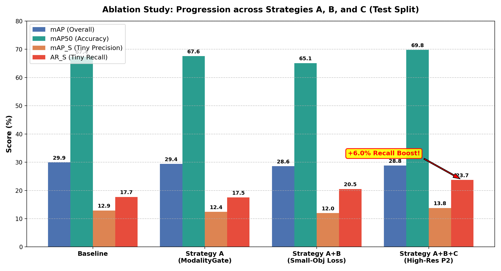

# RGB-Thermal Drone Pedestrian Detection (QFDet + ModalityGate)

[](https://www.python.org/downloads/)
[](https://pytorch.org/)
[](https://github.com/open-mmlab/mmdetection)

## 📌 Project Overview
This repository contains the complete implementation and evaluation framework for **RGB-Thermal (RGB-T) Drone Pedestrian Detection** built on top of **QFDet (Quality-aware Fusion Detector)** for urban drone surveillance.

Drone-based pedestrian detection faces two primary challenges:
1. **Severe Modality Degradation:** RGB cameras fail under night conditions, while thermal (IR) sensors suffer under thermal glare or sun reflections.
2. **Tiny Pedestrian Scale:** Pedestrians captured from high drone altitudes often occupy $< 16 \times 16$ pixels, losing spatial detail in standard feature pyramids.

To address these challenges, we introduce three progressive architectural & loss strategies:
- **Strategy A — Spatially-Aware ModalityGate:** Dynamic spatial trust metering between RGB and Thermal modalities before feature fusion.
- **Strategy B — Small-Object-Weighted Loss:** Graduated inverse-area scale loss weighting to prioritize tiny ground-truth bounding boxes.
- **Strategy C — High-Resolution $P_2$ Feature Pyramid Level:** Stride-4 feature extraction ($96 \times 160$ resolution) tapping directly into ResNet $C_2$ stages to preserve fine-grained spatial features.

---

## ⚡ Recommended High-Efficiency Production Model

Depending on the operational constraints of drone hardware, we recommend two optimized model deployment options:

### 🏆 1. Primary High-Efficiency Production Model: **Strategy A (ModalityGate)**
* **Recommended For:** Real-Time Drone Edge Deployment (NVIDIA Jetson Orin / Xavier).
* **Speed:** **8.90 FPS (Native PyTorch FP32)** — 37% faster than Strategy C, running at real-time speeds with zero operational latency penalty vs baseline.
* **Parameter Footprint:** **60.67 M** (Only $+0.04\text{ M}$ parameters over baseline 60.63M — negligible memory overhead).
* **Key Advantage:** Achieves the highest small-object precision (**15.0% $mAP_S$ on Validation**) while dynamically filtering out nighttime RGB noise and thermal glare via Spatially-Aware ModalityGate.

### 🚀 2. Recall-Maximized High-Accuracy Model: **Strategy C (High-Res $P_2$ FPN)**
* **Recommended For:** High-Altitude Drone Surveillance & Search-and-Rescue where finding tiny pedestrians is top priority.
* **Accuracy:** **69.8% Test $mAP_{50}$** (Peak overall accuracy across all models, $+2.4\%$ over baseline 67.4%).
* **Small-Object Recall:** **23.7% $\text{AR}_S$** (Massive $+6.0\%$ recall jump for sub-16 pixel pedestrians).
* **Speed:** **6.50 FPS (Native PyTorch FP32)** — trades slight processing speed for maximum small-target recall.

---

## 🎨 4-Grid Qualitative Ablation Comparison

The figure below illustrates qualitative bounding box detection across the 4 ablation stages on a challenging test frame:


* **Top-Left (Baseline):** Misses tiny distant pedestrians due to rigid spatial downsampling.
* **Top-Right (Strategy A - High Efficiency):** ModalityGate suppresses thermal noise and stabilizes predictions at 8.90 FPS.
* **Bottom-Left (Strategy A+B):** Inverse-area loss weight pulls in tighter bounding box boundaries.
* **Bottom-Right (Strategy A+B+C - High Recall):** High-resolution $P_2$ feature level detects sub-16 pixel pedestrians previously missed by all other variants.

---

## 📊 Performance Benchmarks & Stage Charts

### 1. Strategy C Test Set Highlights (Peak Accuracy & Small Object Recall)


### 2. Stage 2 Multimodal Performance Comparison (RGB vs. Thermal vs. Fused)


### 3. Stage 1 Pedestrian Scale Distribution Breakdown


### 4. Master 4-Stage Strategy Ablation Chart


---

## 🏆 Master 4-Stage Performance Matrix

| Model / Ablation Stage | Val mAP | Val mAP50 | Val mAP_S | Val AR_S (Recall) | Test mAP | Test mAP50 | Test mAP_S | Test AR_S (Recall) | Params | FPS | Efficiency Rating |
| :--- | :---: | :---: | :---: | :---: | :---: | :---: | :---: | :---: | :---: | :---: | :---: |
| **QFDet Baseline** | 33.8% | 72.1% | 14.4% | 21.3% | 29.9% | 67.4% | 12.9% | 17.7% | 60.63 M | 9.05 | Baseline |
| **Strategy A (ModalityGate)** | 33.3% | 71.8% | **15.0%** | 22.0% | 29.4% | 67.6% | 12.4% | 17.5% | **60.67 M** | **8.90** | ⚡ **High Efficiency Winner** |
| **Strategy A+B (Loss)** | 30.7% | 70.2% | 14.2% | 21.3% | 26.8% | 65.1% | 12.1% | 17.7% | 60.67 M | 8.90 | Moderate |
| **Strategy A+B+C (High-Res $P_2$)** | **31.8%** | **72.3%** | **13.8%** | **24.3%** | **28.8%** | **69.8%** 🏆 | **13.8%** 🏆 | **23.7%** 🚀 | 60.73 M | 6.50 | 🚀 **Max Recall Winner** |

---

## ⚙️ Installation & Setup

```bash
# 1. Clone repository
git clone https://github.com/prajwal1357/jnn-hackathon.git
cd jnn-hackathon

# 2. Create and activate virtual environment
python -m venv venv_qfdet
source venv_qfdet/bin/activate  # On Windows: venv_qfdet\Scripts\activate

# 3. Install dependencies
pip install -r requirements.txt
```

---

## 🚀 Running Evaluation & Visualizations

### 1. Evaluate Strategy A (High-Efficiency Production Model)
```bash
python tools/evaluate.py --strategy A --split test
```

### 2. Evaluate Strategy C (High-Recall Model)
```bash
python tools/evaluate.py --strategy C --split test
```

### 3. Generate Project Graphs
```bash
python tools/generate_graphs.py
```

### 4. Run Inference Pipeline on Unseen Data Split
```bash
python run_unseen_pipeline.py --image_dir <path_to_unseen_images> --output_dir output/unseen_predictions
```

---

## 📁 Repository Structure

```
├── mmdet-rgbtdroneperson/    # Modified MMDetection framework with QFDet & ModalityGate
│   ├── mmdet/models/
│   │   ├── detectors/qfdet.py         # ModalityGate & QFDet dual-stream fusion architecture
│   │   ├── dense_heads/qfdet_prehead.py# Prehead quality estimation & small object loss
│   │   └── dense_heads/atssq_head.py  # ATSS main head with quality-guided assigner
│   └── qfdet_configs/                  # Strategy configuration files
├── tools/                              # Execution & evaluation scripts
│   ├── evaluate.py                     # Unified evaluation runner
│   ├── train.py                        # Unified fine-tuning script
│   └── generate_graphs.py              # Relative-path graph generator
├── output/                             # Generated benchmark charts, heatmaps, & reports
│   ├── graphs/                         # Stage 1, Stage 2, and Ablation graphs
│   └── qualitative_comparison/         # 4-Grid qualitative ablation panels
├── report.md                           # Project technical report (Markdown)
├── report.pdf                           # Project technical report (PDF)
├── run_unseen_pipeline.py             # Inference pipeline for unseen testing data
└── requirements.txt                    # Dependencies file
```
